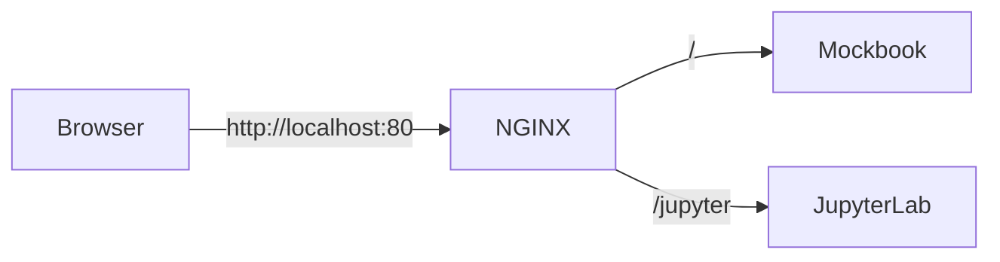

# mockbook

[](https://opensource.org/licenses/MIT)
[](https://hub.docker.com/r/lasuillard/mockbook)

Docker image for writing mocks with Jupyter and FastAPI.


## ✨ Features

Mockbook is a simple FastAPI application with the following features:

- Write mock endpoints with a [FastAPI](https://fastapi.tiangolo.com/) server and live reloading.
- Use [Jupyter](https://jupyter.org/) Notebook to manage mock endpoints
- Preconfigured [NGINX](https://nginx.org/) reverse proxy with a reloader triggered by configuration file changes for flexible mocking.
- Preinstalled libraries for writing mocks: [factory-boy](https://github.com/FactoryBoy/factory_boy), [Faker](https://github.com/joke2k/faker)

## 🚀 How to use

To pull and run the image from [Docker Hub](https://hub.docker.com/r/lasuillard/mockbook), run:

```bash
$ docker run --rm \
    -p 127.0.0.1:80:80 \
    -e JUPYTERLAB_ARGS='--NotebookApp.token=token' \
    lasuillard/mockbook:main
```

The following endpoints are available (via NGINX):



- http://localhost:80/docs for FastAPI OpenAPI documentation
- http://localhost:80/jupyter for the JupyterLab web UI

### ⚙️ Environment variables

| Key                            | Description                                                                                                                                               |
| ------------------------------ | --------------------------------------------------------------------------------------------------------------------------------------------------------- |
| `MOCKBOOK_ARGS`                | Extra arguments for Mockbook's uvicorn server (`uvicorn`).                                                                                                           |
| `MOCKBOOK_AUTORELOAD_DISABLED` | Disable auto reloading (`--reload`). <br/>May be useful for certain environments (such as testing) where reloading is not desirable. |
| `JUPYTERLAB_ARGS`              | Extra arguments for JupyterLab (`jupyter lab`).                                                                                                                           |
| `JUPYTERLAB_DISABLED`          | Disable the JupyterLab service. <br/>May be useful for certain environments (such as testing) where the notebook is unnecessary.                                     |
| `NGINX_ARGS`                   | Extra arguments to pass to NGINX (`nginx`).                                                                                                                         |
| `NGINX_DISABLED`               | Disable the NGINX service.                                                                                                                                    |
| `NGINX_RELOADER_DISABLED`      | Disable the NGINX reloader.                                                                                                                                   |

### 📂 Mount points

- `/app/mockbook/notebooks` for Jupyter notebooks. The Mockbook app watches `/app/mockbook/` for changes and reloads FastAPI automatically.
- `/app/mockbook/nginx/conf.d` for NGINX configuration. The auto reloader watches this directory and reloads NGINX automatically.

Please check the [examples](/examples) directory for more usage examples.

## 💖 Contributing

Please refer to [CONTRIBUTING.md](./CONTRIBUTING.md) for more information on how to contribute to this project.

## 📜 License

This project is licensed under the MIT License.
